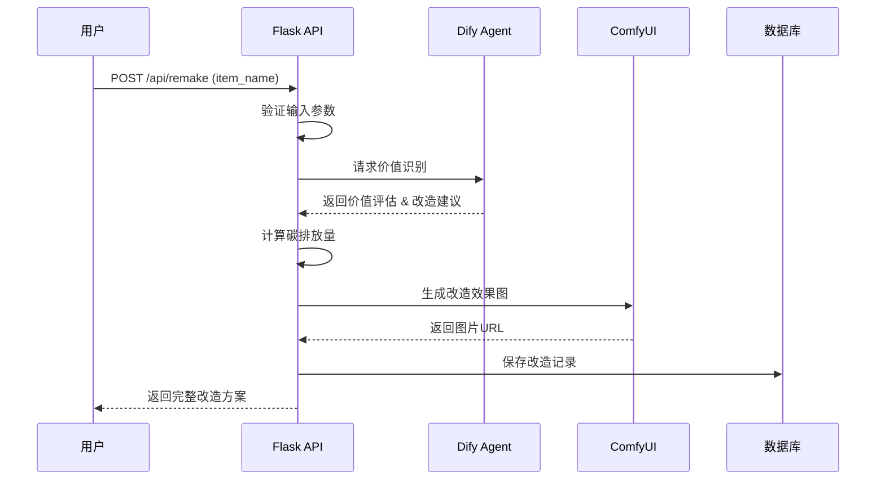

# Remake AI 软件设计规约 (SDD)

## 1. 项目概述

### 1.1 项目名称
Remake AI - 闲置资源回收利用智能平台

### 1.2 项目目标
利用AI技术识别闲置物品的价值，并生成创意改造效果图，促进资源循环利用，减少碳排放。

### 1.3 核心功能
- 接收用户提交的闲置物品名称
- 通过Dify AI识别物品价值和改造潜力
- 通过ComfyUI生成物品改造效果图
- 记录用户环保贡献数据（碳排放量减少）

---

## 2. 系统架构

### 2.1 技术栈
- **后端框架**: Flask (Python)
- **AI服务**:
  - Dify Agent: 物品价值识别与改造建议
  - ComfyUI: 改造效果图生成
- **数据库**: SQLite (开发环境) / PostgreSQL (生产环境)
- **前端**: HTML + JavaScript + CSS

### 2.2 架构图
```
┌─────────────┐
│   用户端    │
│ (Web界面)   │
└──────┬──────┘
       │ HTTP
       ▼
┌─────────────────────────────┐
│      Flask 后端服务          │
│  ┌──────────────────────┐  │
│  │  /api/remake API     │  │
│  └──────────┬───────────┘  │
└─────────────┼──────────────┘
              │
    ┌─────────┴─────────┐
    │                   │
    ▼                   ▼
┌─────────┐      ┌─────────────┐
│  Dify   │      │  ComfyUI    │
│  Agent  │      │   客户端    │
└─────────┘      └─────────────┘
    │                   │
    └─────────┬─────────┘
              │
              ▼
      ┌───────────────┐
      │    数据库     │
      │ (SQLite/PG)   │
      └───────────────┘
```

---

## 3. API 设计

### 3.1 核心API接口

#### 3.1.1 闲置物品改造接口
**接口路径**: `POST /api/remake`

**请求参数**:
```json
{
  "user_id": "string",      // 用户ID（可选，支持匿名）
  "item_name": "string",    // 物品名称（必填）
  "description": "string"   // 物品描述（可选）
}
```

**响应格式**:
```json
{
  "success": true,
  "data": {
    "item_id": "string",           // 物品记录ID
    "item_name": "string",         // 物品名称
    "value_assessment": {          // 价值评估
      "value_score": 85,           // 价值评分 0-100
      "category": "string",         // 物品类别
      "material_type": "织物",      // 材质类型：织物/塑料/金属/玻璃/纸/木材/其他
      "reuse_potential": "高/中/低",
      "suggestions": ["改造建议1", "改造建议2"],     // 实用性改造建议
      "diy_ideas": ["创意想法1", "创意想法2"]        // 创意DIY想法
    },
    "remake_images": [             // 改造效果图
      {
        "image_id": "string",
        "image_url": "string",     // 图片URL
        "caption": "string",       // 图片说明
        "prompt": "string",        // 生成提示词
        "params": {
          "steps": 30,             // 采样步数
          "cfg_scale": 7.5,        // CFG Scale
          "seed": 123456
        }
      }
    ],
    "carbon_saving": {              // 碳减排数据
      "saved_kg": 2.5,             // 减少的碳排放量(kg)
      "equivalent_to": "种植1.5棵树" // 通俗解释
    },
    "created_at": "2026-02-13T10:00:00Z"
  }
}
```

**错误响应**:
```json
{
  "success": false,
  "error": {
    "code": "INVALID_INPUT",
    "message": "物品名称不能为空"
  }
}
```

---

### 3.2 辅助API接口

#### 3.2.1 获取用户环保记录
**接口路径**: `GET /api/user/:user_id/records`

**响应**:
```json
{
  "success": true,
  "data": {
    "user_id": "string",
    "total_items": 10,
    "total_carbon_saved": 25.5,
    "records": [
      {
        "item_id": "string",
        "item_name": "string",
        "carbon_saved": 2.5,
        "created_at": "ISO8601"
      }
    ]
  }
}
```

#### 3.2.2 获取热门改造案例
**接口路径**: `GET /api/trending/remakes`

**响应**:
```json
{
  "success": true,
  "data": [
    {
      "item_name": "旧牛仔裤",
      "remake_count": 150,
      "avg_carbon_saved": 3.2,
      "preview_image": "url"
    }
  ]
}
```

---

## 4. 数据库设计

### 4.1 表结构

#### 4.1.1 remake_records 表（改造记录）
```sql
CREATE TABLE remake_records (
    id INTEGER PRIMARY KEY AUTOINCREMENT,
    user_id VARCHAR(100) NOT NULL,           -- 用户ID
    item_name VARCHAR(200) NOT NULL,          -- 物品名称
    description TEXT,                          -- 物品描述
    value_score INTEGER,                      -- 价值评分 0-100
    category VARCHAR(50),                      -- 物品类别
    reuse_potential VARCHAR(20),               -- 改造潜力: 高/中/低
    suggestions JSON,                         -- 改造建议（数组）
    image_urls JSON,                           -- 改造效果图URL列表
    carbon_saved DECIMAL(10, 2),              -- 减少的碳排放量(kg)
    dify_response JSON,                       -- Dify响应原始数据
    comfyui_response JSON,                    -- ComfyUI响应原始数据
    status VARCHAR(20) DEFAULT 'completed',   -- 状态: processing/completed/failed
    error_message TEXT,                       -- 错误信息
    created_at TIMESTAMP DEFAULT CURRENT_TIMESTAMP,
    updated_at TIMESTAMP DEFAULT CURRENT_TIMESTAMP
);

CREATE INDEX idx_user_id ON remake_records(user_id);
CREATE INDEX idx_item_name ON remake_records(item_name);
CREATE INDEX idx_created_at ON remake_records(created_at);
```

#### 4.1.2 carbon_factors 表（碳排放因子）
```sql
CREATE TABLE carbon_factors (
    id INTEGER PRIMARY KEY AUTOINCREMENT,
    category VARCHAR(50) NOT NULL UNIQUE,    -- 物品类别
    item_type VARCHAR(100) NOT NULL,          -- 物品类型
    carbon_saved_per_kg DECIMAL(10, 2),      -- 每kg减少的碳排放量
    description TEXT,                         -- 描述
    created_at TIMESTAMP DEFAULT CURRENT_TIMESTAMP
);
```

### 4.2 数据模型

#### 4.2.1 RemakeRecord (Python)
```python
from dataclasses import dataclass
from datetime import datetime
from typing import List, Optional

@dataclass
class RemakeRecord:
    id: Optional[int]
    user_id: str
    item_name: str
    description: Optional[str]
    value_score: Optional[int]
    category: Optional[str]
    reuse_potential: Optional[str]
    suggestions: List[str]
    image_urls: List[str]
    carbon_saved: float
    dify_response: dict
    comfyui_response: dict
    status: str = 'completed'
    error_message: Optional[str] = None
    created_at: Optional[datetime] = None
    updated_at: Optional[datetime] = None
```

---

## 5. 业务逻辑流程

### 5.1 核心流程：物品改造



### 5.2 详细步骤

#### 步骤1: 接收请求
```python
def validate_remake_request(data):
    """验证改造请求参数"""
    if not data.get('item_name'):
        raise ValueError("物品名称不能为空")
    if len(data['item_name']) > 200:
        raise ValueError("物品名称过长")
    return True
```

#### 步骤2: 调用Dify识别价值

##### 2.1 物品材质分类映射
```python
# 物品名称到材质类别的映射规则
MATERIAL_CATEGORY_MAPPING = {
    # 织物类
    "牛仔裤": "织物", "裤子": "织物", "T恤": "织物", "衬衫": "织物",
    "衣服": "织物", "裙子": "织物", "外套": "织物", "毛衣": "织物",
    "袜子": "织物", "围巾": "织物", "帽子": "织物", "布料": "织物",

    # 塑料类
    "瓶子": "塑料", "塑料瓶": "塑料", "瓶盖": "塑料", "塑料袋": "塑料",
    "玩具": "塑料", "塑料盒": "塑料", "塑料桶": "塑料", "塑料管": "塑料",

    # 金属类
    "易拉罐": "金属", "铝罐": "金属", "铁盒": "金属", "金属罐": "金属",
    "铜线": "金属", "铝箔": "金属", "金属片": "金属", "金属管": "金属",

    # 玻璃类
    "玻璃瓶": "玻璃", "玻璃罐": "玻璃", "玻璃杯": "玻璃", "玻璃器皿": "玻璃",

    # 纸制品
    "纸箱": "纸", "纸盒": "纸", "报纸": "纸", "书本": "纸", "纸张": "纸",

    # 木材类
    "木板": "木材", "木箱": "木材", "木棍": "木材", "木盒": "木材",

    # 电子类
    "手机": "电子", "电脑": "电子", "键盘": "电子", "鼠标": "电子",
    "电池": "电子", "电线": "电子", "电子元件": "电子",

    # 其他
    "轮胎": "橡胶", "鞋": "皮革", "陶瓷": "陶瓷", "陶瓷器皿": "陶瓷"
}
```

##### 2.2 材质识别函数
```python
def identify_material_category(item_name: str) -> str:
    """
    根据物品名称识别材质类别

    Args:
        item_name: 物品名称

    Returns:
        材质类别：织物/塑料/金属/玻璃/纸/木材/电子/橡胶/皮革/陶瓷/其他
    """
    item_name_lower = item_name.lower()

    # 直接匹配映射表
    for keyword, category in MATERIAL_CATEGORY_MAPPING.items():
        if keyword in item_name_lower:
            return category

    # 关键词匹配
    if any(kw in item_name_lower for kw in ["布", "棉", "麻", "丝", "毛", "绒"]):
        return "织物"
    if any(kw in item_name_lower for kw in ["塑", "plastic"]):
        return "塑料"
    if any(kw in item_name_lower for kw in ["金属", "铝", "铁", "铜", "钢", "metal"]):
        return "金属"
    if any(kw in item_name_lower for kw in ["玻璃", "glass"]):
        return "玻璃"
    if any(kw in item_name_lower for kw in ["纸", "paper"]):
        return "纸"
    if any(kw in item_name_lower for kw in ["木", "wood"]):
        return "木材"
    if any(kw in item_name_lower for kw in ["电", "electronic", "电子"]):
        return "电子"

    return "其他"
```

##### 2.3 Dify 分支路由逻辑
```python
def call_dify_agent(item_name: str, description: str = "") -> dict:
    """
    调用Dify Agent评估物品价值（根据材质分类路由）

    Args:
        item_name: 物品名称
        description: 物品描述

    Returns:
        {
            "value_score": 85,
            "category": "纺织品",
            "material_type": "织物",
            "reuse_potential": "高",
            "suggestions": ["改造建议1", "改造建议2", "改造建议3"],
            "diy_ideas": ["创意想法1", "创意想法2"]
        }
    """
    # 步骤1: 识别材质类别
    material_type = identify_material_category(item_name)

    # 步骤2: 根据材质类型选择不同的Prompt模板
    prompt_templates = {
        "织物": f"""
        请分析以下织物类闲置物品的回收价值并给出改造方案：
        物品名称: {item_name}
        材质: 织物（如牛仔布、棉布、毛料等）
        描述: {description}

        请以JSON格式返回，包含：
        - value_score: 价值评分(0-100)
        - category: 物品类别（纺织品、服装、家居织物等）
        - reuse_potential: 改造潜力(高/中/低)
        - suggestions: 实用性改造建议(3-5条，如制作包袋、家居用品、收纳工具等)
        - diy_ideas: 创意DIY想法(2-3条，如艺术创作、时尚单品等)
        """,

        "塑料": f"""
        请分析以下塑料类闲置物品的回收价值并给出改造方案：
        物品名称: {item_name}
        材质: 塑料（如PET、PE、PP等）
        描述: {description}

        请以JSON格式返回，包含：
        - value_score: 价值评分(0-100)
        - category: 物品类别（塑料容器、玩具、家居用品等）
        - reuse_potential: 改造潜力(高/中/低)
        - suggestions: 实用性改造建议(3-5条，如花盆、收纳盒、工具盒等)
        - diy_ideas: 创意DIY想法(2-3条，如艺术装置、灯具、装饰品等)
        """,

        "金属": f"""
        请分析以下金属类闲置物品的回收价值并给出改造方案：
        物品名称: {item_name}
        材质: 金属（如铝、铁、铜等）
        描述: {description}

        请以JSON格式返回，包含：
        - value_score: 价值评分(0-100)
        - category: 物品类别（金属容器、金属制品等）
        - reuse_potential: 改造潜力(高/中/低)
        - suggestions: 实用性改造建议(3-5条，如工具、花盆、烛台等)
        - diy_ideas: 创意DIY想法(2-3条，如艺术雕塑、灯具、装饰品等)
        """,

        "玻璃": f"""
        请分析以下玻璃类闲置物品的回收价值并给出改造方案：
        物品名称: {item_name}
        材质: 玻璃
        描述: {description}

        请以JSON格式返回，包含：
        - value_score: 价值评分(0-100)
        - category: 物品类别（玻璃容器、玻璃器皿等）
        - reuse_potential: 改造潜力(高/中/低)
        - suggestions: 实用性改造建议(3-5条，如花瓶、烛台、储物罐等)
        - diy_ideas: 创意DIY想法(2-3条，如灯具、艺术装饰、马赛克艺术等)
        """,

        "纸": f"""
        请分析以下纸类闲置物品的回收价值并给出改造方案：
        物品名称: {item_name}
        材质: 纸制品
        描述: {description}

        请以JSON格式返回，包含：
        - value_score: 价值评分(0-100)
        - category: 物品类别（纸箱、纸盒、纸张等）
        - reuse_potential: 改造潜力(高/中/低)
        - suggestions: 实用性改造建议(3-5条，如收纳盒、文件夹、手工艺品等)
        - diy_ideas: 创意DIY想法(2-3条，如艺术折纸、纸艺装饰、环保纸袋等)
        """,

        "木材": f"""
        请分析以下木材类闲置物品的回收价值并给出改造方案：
        物品名称: {item_name}
        材质: 木材
        描述: {description}

        请以JSON格式返回，包含：
        - value_score: 价值评分(0-100)
        - category: 物品类别（木板、木箱、木制品等）
        - reuse_potential: 改造潜力(高/中/低)
        - suggestions: 实用性改造建议(3-5条，如家具、园艺工具、储物架等)
        - diy_ideas: 创意DIY想法(2-3条，如艺术装饰、手工艺品、木质摆件等)
        """,

        "其他": f"""
        请分析以下闲置物品的回收价值并给出改造方案：
        物品名称: {item_name}
        描述: {description}

        请以JSON格式返回，包含：
        - value_score: 价值评分(0-100)
        - category: 物品类别
        - reuse_potential: 改造潜力(高/中/低)
        - suggestions: 实用性改造建议(3-5条)
        - diy_ideas: 创意DIY想法(2-3条)
        """
    }

    # 步骤3: 选择对应的Prompt
    prompt = prompt_templates.get(material_type, prompt_templates["其他"])

    # 步骤4: 调用Dify API
    response = dify_client.chat(prompt)
    result = parse_dify_response(response)

    # 步骤5: 添加材质类型到返回结果
    result["material_type"] = material_type

    return result
```

#### 步骤3: 计算碳排放量
```python
def calculate_carbon_savings(category: str, item_name: str) -> float:
    """
    计算物品改造后减少的碳排放量

    计算公式：
    - 基础碳排放 = 该类别每kg物品的平均碳排放
    - 改造减少 = 基础碳排放 × 改造利用率 × 系数
    """
    base_factors = {
        "纺织品": 15.5,    # kg CO2/kg
        "塑料制品": 3.5,
        "金属制品": 8.2,
        "电子产品": 50.0,
        "纸制品": 1.2,
        "家具": 12.0
    }
    base_carbon = base_factors.get(category, 5.0)
    saved_carbon = base_carbon * 0.5  # 假设改造可减少50%排放
    return round(saved_carbon, 2)
```

#### 步骤4: 调用ComfyUI生成效果图

##### 4.1 ComfyUI 参数配置
```python
# ComfyUI生成参数配置
COMFYUI_CONFIG = {
    # 通用参数
    "steps": 30,                # 采样步数：30步保证质量平衡
    "cfg_scale": 7.5,           # CFG Scale：7.5确保创意与指令的平衡
    "seed": -1,                 # 随机种子：-1表示每次随机生成
    "width": 1024,              # 图片宽度：1024px高清
    "height": 1024,             # 图片高度：1024px高清
    "sampler_name": "DPM++ 2M Karras",  # 采样器：高质量快速采样
    "scheduler": "Karras",      # 调度器：Karras优化
    "checkpoint": "v1-5-pruned-emaonly.safetensors",  # 模型：SD 1.5
    "negative_prompt": """
    低质量、模糊、扭曲、变形、丑陋、不自然、
    多余的手指、多余的手、人脸变形、
    糟糕的解剖结构、水印、签名、文字、logo
    """.strip().replace("\n", ", ")
}

# 不同材质的风格提示词模板
STYLE_PROMPTS = {
    "织物": """
    高端艺术改造，变废为宝创意设计，
    专业产品摄影，8K超高清，细节丰富，
    现代简约风格，北欧设计美学，
    自然光拍摄，柔和阴影，材质纹理清晰，
    环保时尚，可持续设计理念
    """,

    "塑料": """
    现代艺术装置，环保创意设计，
    色彩鲜艳，材质反光质感，
    极简主义风格，包豪斯设计理念，
    专业摄影，高对比度，锐利细节，
    变废为宝，可持续材料利用
    """,

    "金属": """
    工业设计美学，金属质感突出，
    冷色调风格，现代主义设计，
    高端产品摄影，反射光泽，
    线条简洁，结构清晰，
    变废为宝，金属回收艺术
    """,

    "玻璃": """
    透明质感，光影艺术效果，
    现代玻璃设计，极简美学，
    高清摄影，光线折射美丽，
    通透质感，精致细节，
    环保玻璃艺术，可持续设计
    """,

    "纸": """
    纸艺设计，手工艺术感，
    自然纹理，纸纤维细节，
    温和色调，日式简约风格，
    柔和自然光，温馨氛围，
    环保纸艺，可持续创意
    """,

    "木材": """
    天然木材纹理，有机美感，
    现代木艺设计，斯堪的纳维亚风格，
    温暖色调，自然光拍摄，
    木纹细节，质感真实，
    环保木艺，可持续材料
    """,

    "其他": """
    现代艺术改造，变废为宝创意，
    高品质产品摄影，细节丰富，
    设计感强烈，视觉冲击力强，
    环保理念，可持续发展，
    专业构图，美学呈现
    """
}
```

##### 4.2 图片生成函数
```python
def generate_remake_images(
    item_name: str,
    suggestions: list,
    material_type: str = "其他"
) -> list:
    """
    调用ComfyUI生成改造效果图

    Args:
        item_name: 物品名称
        suggestions: 改造建议列表
        material_type: 材质类别

    Returns:
        [
            {
                "image_id": "uuid",
                "image_url": "http://...",
                "prompt": "完整提示词",
                "caption": "图片说明",
                "params": {
                    "steps": 30,
                    "cfg_scale": 7.5,
                    "seed": 123456
                }
            }
        ]
    """
    images = []

    # 获取对应材质的风格提示词
    style_prompt = STYLE_PROMPTS.get(material_type, STYLE_PROMPTS["其他"])

    for i, suggestion in enumerate(suggestions[:3]):  # 生成最多3张图
        # 构建完整提示词
        positive_prompt = f"""
        创意改造设计作品：将{item_name}改造成{suggestion}
        {style_prompt}
        Masterpiece, best quality, highly detailed
        """.strip().replace("\n", ", ")

        # 生成随机种子
        current_seed = COMFYUI_CONFIG["seed"] if COMFYUI_CONFIG["seed"] != -1 else random.randint(0, 2**32 - 1)

        # 调用ComfyUI API
        generation_params = {
            "prompt": positive_prompt,
            "negative_prompt": COMFYUI_CONFIG["negative_prompt"],
            "steps": COMFYUI_CONFIG["steps"],
            "cfg_scale": COMFYUI_CONFIG["cfg_scale"],
            "seed": current_seed,
            "width": COMFYUI_CONFIG["width"],
            "height": COMFYUI_CONFIG["height"],
            "sampler_name": COMFYUI_CONFIG["sampler_name"],
            "scheduler": COMFYUI_CONFIG["scheduler"],
            "checkpoint": COMFYUI_CONFIG["checkpoint"]
        }

        # 调用comfyui_client生成图片
        image_url = comfyui_client.generate(generation_params)

        images.append({
            "image_id": generate_uuid(),
            "image_url": image_url,
            "prompt": positive_prompt,
            "caption": f"{item_name} 改造为 {suggestion}",
            "params": {
                "steps": COMFYUI_CONFIG["steps"],
                "cfg_scale": COMFYUI_CONFIG["cfg_scale"],
                "seed": current_seed
            }
        })

    return images
```

##### 4.3 ComfyUI 客户端接口规范
```python
class ComfyUIClient:
    """ComfyUI客户端封装"""

    def __init__(self, api_url: str = "http://localhost:8188"):
        self.api_url = api_url

    def generate(self, params: dict) -> str:
        """
        生成图片

        Args:
            params: 生成参数
                - prompt: 正向提示词
                - negative_prompt: 负向提示词
                - steps: 采样步数 (默认30)
                - cfg_scale: CFG Scale (默认7.5)
                - seed: 随机种子
                - width: 图片宽度 (默认1024)
                - height: 图片高度 (默认1024)
                - sampler_name: 采样器名称
                - scheduler: 调度器名称
                - checkpoint: 模型检查点

        Returns:
            image_url: 生成的图片URL
        """
        # 构建ComfyUI工作流JSON
        workflow = self._build_workflow(params)

        # 发送到ComfyUI API
        response = requests.post(
            f"{self.api_url}/prompt",
            json={"prompt": workflow},
            timeout=300  # 5分钟超时
        )

        result = response.json()

        # 获取图片URL
        image_url = self._get_image_url(result)

        return image_url

    def _build_workflow(self, params: dict) -> dict:
        """构建ComfyUI工作流"""
        return {
            "1": {
                "inputs": {
                    "text": params["prompt"],
                    "clip": ["4", 1]
                },
                "class_type": "CLIPTextEncode"
            },
            "2": {
                "inputs": {
                    "text": params["negative_prompt"],
                    "clip": ["4", 1]
                },
                "class_type": "CLIPTextEncode"
            },
            "3": {
                "inputs": {
                    "seed": params["seed"],
                    "steps": params["steps"],
                    "cfg": params["cfg_scale"],
                    "sampler_name": params["sampler_name"],
                    "scheduler": params["scheduler"],
                    "denoise": 1.0,
                    "model": ["4", 0],
                    "positive": ["1", 0],
                    "negative": ["2", 0],
                    "latent_image": ["5", 0]
                },
                "class_type": "KSampler"
            },
            "4": {
                "inputs": {
                    "ckpt_name": params["checkpoint"]
                },
                "class_type": "CheckpointLoaderSimple"
            },
            "5": {
                "inputs": {
                    "width": params["width"],
                    "height": params["height"],
                    "batch_size": 1
                },
                "class_type": "EmptyLatentImage"
            },
            "6": {
                "inputs": {
                    "samples": ["3", 0],
                    "vae": ["4", 2]
                },
                "class_type": "VAEDecode"
            },
            "7": {
                "inputs": {
                    "filename_prefix": "remake_ai",
                    "images": ["6", 0]
                },
                "class_type": "SaveImage"
            }
        }

    def _get_image_url(self, result: dict) -> str:
        """获取图片URL"""
        prompt_id = result["prompt_id"]

        # 轮询获取生成结果
        while True:
            response = requests.get(f"{self.api_url}/history/{prompt_id}")
            history = response.json()

            if prompt_id in history:
                outputs = history[prompt_id]["outputs"]
                if "7" in outputs:  # SaveImage节点
                    images = outputs["7"]["images"]
                    image_name = images[0]["filename"]
                    return f"{self.api_url}/view?filename={image_name}"

            time.sleep(1)
```

#### 步骤5: 保存到数据库
```python
def save_remake_record(record: RemakeRecord) -> int:
    """保存改造记录到数据库"""
    conn = get_db_connection()
    cursor = conn.cursor()
    
    cursor.execute('''
        INSERT INTO remake_records (
            user_id, item_name, description, value_score,
            category, reuse_potential, suggestions, image_urls,
            carbon_saved, dify_response, comfyui_response, status
        ) VALUES (?, ?, ?, ?, ?, ?, ?, ?, ?, ?, ?, ?)
    ''', (
        record.user_id, record.item_name, record.description,
        record.value_score, record.category, record.reuse_potential,
        json.dumps(record.suggestions), json.dumps(record.image_urls),
        record.carbon_saved, json.dumps(record.dify_response),
        json.dumps(record.comfyui_response), record.status
    ))
    
    record_id = cursor.lastrowid
    conn.commit()
    conn.close()
    return record_id
```

---

## 6. 环保数据计算

### 6.1 碳排放计算公式

```
碳排放减少量 = 基础排放因子 × 物品权重 × 改造利用率 × 减排系数

其中：
- 基础排放因子：从carbon_factors表获取（单位：kg CO2/kg）
- 物品权重：默认1.0（可按物品类型调整）
- 改造利用率：默认0.5（改造后可减少50%新物品生产）
- 减排系数：默认1.0
```

### 6.2 环保贡献等价说明

```python
CARBON_EQUIVALENTS = {
    "tree": 0.018,      # 1棵树每年吸收18kg CO2
    "car": 0.0002,      # 1km汽车排放0.2kg CO2
    "electricity": 0.5, # 1度电约排放0.5kg CO2
    "meat": 5.0         # 1kg牛肉约排放5kg CO2
}

def get_equivalent_description(carbon_saved: float) -> dict:
    """将碳排放量转换为通俗说法"""
    return {
        "tree": f"相当于种植 {carbon_saved / 0.018:.1f} 棵树",
        "car": f"相当于减少汽车行驶 {carbon_saved / 0.0002:.1f} 公里",
        "electricity": f"相当于节约 {carbon_saved / 0.5:.1f} 度电",
        "meat": f"相当于减少消费 {carbon_saved / 5.0:.1f} kg 牛肉"
    }
```

---

## 7. 错误处理

### 7.1 错误码定义

| 错误码 | 说明 |
|--------|------|
| INVALID_INPUT | 输入参数无效 |
| DIFY_API_ERROR | Dify API调用失败 |
| COMFYUI_ERROR | ComfyUI生成失败 |
| DATABASE_ERROR | 数据库操作失败 |
| RATE_LIMITED | 请求过于频繁 |

### 7.2 异常处理策略

```python
try:
    # 主流程
    record = process_remake_request(user_id, item_name)
    return success_response(record)

except ValueError as e:
    return error_response("INVALID_INPUT", str(e))

except DifyError as e:
    return error_response("DIFY_API_ERROR", str(e))

except ComfyUIError as e:
    return error_response("COMFYUI_ERROR", str(e))

except Exception as e:
    logger.error(f"Unexpected error: {e}")
    return error_response("INTERNAL_ERROR", "服务器内部错误")
```

---

## 8. 安全与性能

### 8.1 安全措施
- **输入验证**: 所有用户输入必须经过验证
- **SQL注入防护**: 使用参数化查询
- **速率限制**: 每用户每分钟最多5次请求
- **数据脱敏**: 敏感信息加密存储

### 8.2 性能优化
- **缓存**: Dify响应缓存5分钟
- **异步处理**: ComfyUI图片生成异步执行
- **数据库索引**: 常用查询字段添加索引
- **连接池**: 数据库连接复用

---

## 9. 部署说明

### 9.1 环境要求
```txt
Flask==3.0.0
requests==2.31.0
python-dotenv==1.0.0
sqlite3 (内建)
```

### 9.2 配置文件
```env
# .env
FLASK_ENV=development
FLASK_PORT=5000

# Dify配置
DIFY_API_KEY=your_dify_api_key
DIFY_API_URL=https://api.dify.ai

# ComfyUI配置
COMFYUI_API_URL=http://localhost:8188
COMFYUI_CHECKPOINT=default

# 数据库配置
DATABASE_URL=sqlite:///remake_ai.db
```

### 9.3 启动命令
```bash
# 安装依赖
pip install -r requirements.txt

# 初始化数据库
python init_db.py

# 启动服务
python remake_app.py
```

---

## 10. 附录

### 10.1 开发计划
1. **Phase 1** (Week 1): API接口开发
2. **Phase 2** (Week 2): Dify集成
3. **Phase 3** (Week 3): ComfyUI集成
4. **Phase 4** (Week 4): 前端开发
5. **Phase 5** (Week 5): 测试与优化

### 10.2 技术文档
- [Dify集成文档](./DIFY_AGENT_FEATURE.md)
- [ComfyUI集成文档](./SKIN_GENERATOR_SDD.md)
- [数据库设计文档](./IMPLEMENTATION_PLAN.md)

---

**文档版本**: v1.0  
**创建日期**: 2026-02-13  
**最后更新**: 2026-02-13
