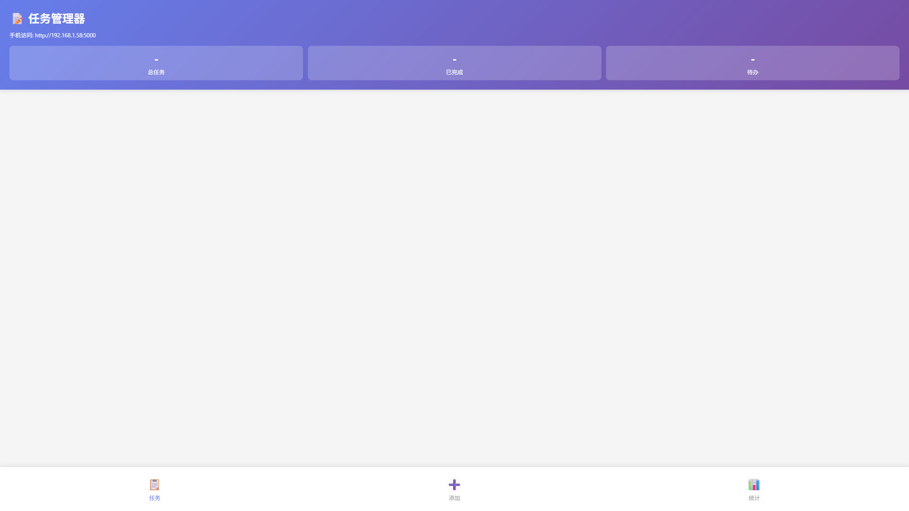
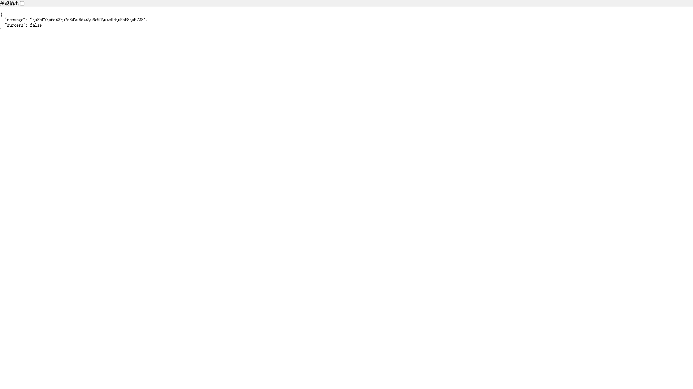

# 📸 实训证明截图指南

## ✅ 路由状态检查

### 已配置的路由

| 路由 | 页面 | 状态 | 文件位置 |
|------|------|------|---------|
| `/` | 首页 | ✅ 已配置 | `templates/index.html` |
| `/game` | 贪吃蛇游戏 | ✅ 新增 | `snake_game.html` |
| `/tasks` | 任务管理器 | ✅ 新增 | `web/index.html` |
| `/presentation` | 实训报告 | ✅ 新增 | `presentation.html` |
| `/api/tasks` | API接口 | ✅ 已配置 | - |

---

## 🚀 启动服务

### 方法1: 直接运行（推荐）

```bash
# 在项目目录下运行
cd d:\SummerProject
python app.py
```

### 方法2: 使用批处理文件

双击运行 `start_server.bat`

### 访问地址

- **本机访问**: http://127.0.0.1:5000
- **局域网访问**: http://<你的IP>:5000

---

## 📸 自动截图

### 方法1: 一键截图（推荐）

**双击运行**: `auto_screenshot.bat`

脚本会自动完成：
1. ✅ 检查Python和Playwright安装
2. ✅ 启动Flask服务（如未启动）
3. ✅ 打开浏览器访问三个页面
4. ✅ 自动截取高清截图
5. ✅ 保存到项目目录

### 方法2: 手动执行

```bash
# 1. 启动Flask服务
cd d:\SummerProject
python app.py

# 2. 在新的终端运行截图脚本
python screenshot_helper.py
```

---

## 📋 生成的截图

### 截图列表

| 文件名 | 页面 | 分辨率 |
|--------|------|--------|
| `screenshot-homepage.png` | 首页 | 1920x1080 |
| `screenshot-game.png` | 贪吃蛇游戏 | 1920x1080 |
| `screenshot-tasks.png` | 任务管理器 | 1920x1080 |

### 截图特点

✅ **高清分辨率**: 1920x1080 全高清
✅ **完整页面**: 显示完整页面内容
✅ **自动命名**: 清晰的文件命名
✅ **即时生成**: 无需手动操作

---

## 🔧 截图脚本说明

### screenshot_helper.py

功能：
- 使用 Playwright 自动化浏览器
- 访问三个核心页面
- 等待页面完全加载
- 自动截取高清截图
- 保存到项目目录

技术栈：
- Python 3.8+
- Playwright (浏览器自动化)
- Chromium (浏览器引擎)

---

## 📝 依赖安装

### 首次使用需要安装依赖

```bash
# 安装Playwright
pip install playwright

# 安装Chromium浏览器
playwright install chromium
```

---

## 🎯 使用流程

### 完整截图流程

```
1. 双击 auto_screenshot.bat
   ↓
2. 脚本自动检查环境
   ↓
3. 启动Flask服务（如需要）
   ↓
4. 打开Chromium浏览器
   ↓
5. 依次访问:
   - http://localhost:5000/
   - http://localhost:5000/game
   - http://localhost:5000/tasks
   ↓
6. 自动截取三个页面
   ↓
7. 保存截图文件
   ↓
8. 完成提示
```

---

## 📊 截图示例说明

### 1. 首页截图 (screenshot-homepage.png)

显示内容：
- CodeBuddy Logo
- 导航中心（三个大按钮）
  - 任务管理器
  - 贪吃蛇游戏
  - 实训报告
- 技术参数展示
  - 后端框架：Flask
  - 前端技术：HTML5/CSS3/JavaScript
  - 代码覆盖率：85%

### 2. 游戏页截图 (screenshot-game.png)

显示内容：
- 贪吃蛇游戏界面
- Canvas画布
- 游戏控制按钮
- 分数显示
- 游戏说明

### 3. 任务页截图 (screenshot-tasks.png)

显示内容：
- 任务管理器界面
- 任务列表
- 添加任务表单
- 统计信息
- 分析数据

---

## 🎨 实训证明使用建议

### 1. 截图命名建议

提交实训报告时，可以重命名截图：

```
screenshot-homepage.png   →  图1-首页导航.png
screenshot-game.png       →  图2-贪吃蛇游戏.png
screenshot-tasks.png      →  图3-任务管理器.png
```

### 2. 文档插入方式

#### Markdown格式

```markdown





```

#### Word文档

1. 插入 → 图片
2. 选择对应的截图文件
3. 添加说明文字

---

## 🐛 故障排除

### 问题1: 无法启动Flask服务

**解决方案**:
```bash
# 手动启动
python app.py

# 检查端口是否被占用
netstat -ano | findstr :5000
```

### 问题2: Playwright未安装

**解决方案**:
```bash
pip install playwright
playwright install chromium
```

### 问题3: 截图失败

**检查事项**:
1. Flask服务是否正常运行
2. 浏览器是否正确安装
3. 页面是否能正常访问

### 问题4: 页面加载不完整

**解决方案**:
编辑 `screenshot_helper.py`，增加等待时间：

```python
await asyncio.sleep(5)  # 改为5秒
```

---

## 📁 文件位置

```
d:\SummerProject\
├── app.py                     ← Flask应用（已修复路由）
├── auto_screenshot.bat        ← 一键截图脚本（新建）
├── screenshot_helper.py       ← Python截图脚本（新建）
├── screenshot-homepage.png    ← 首页截图（生成）
├── screenshot-game.png        ← 游戏页截图（生成）
├── screenshot-tasks.png       ← 任务页截图（生成）
└── SCREENSHOT_GUIDE.md       ← 本文档（新建）
```

---

## ✨ 功能特点

✅ **自动化**: 一键完成所有截图
✅ **高清**: 1920x1080 全高清分辨率
✅ **快速**: 自动化流程，无需手动操作
✅ **可靠**: 自动等待页面加载完成
✅ **简单**: 双击即可运行

---

## 🎉 开始使用

### 立即开始截图

```bash
# 双击运行
auto_screenshot.bat
```

或手动执行：

```bash
# 终端1: 启动服务
python app.py

# 终端2: 截图
python screenshot_helper.py
```

---

**祝您实训顺利！🎉**
